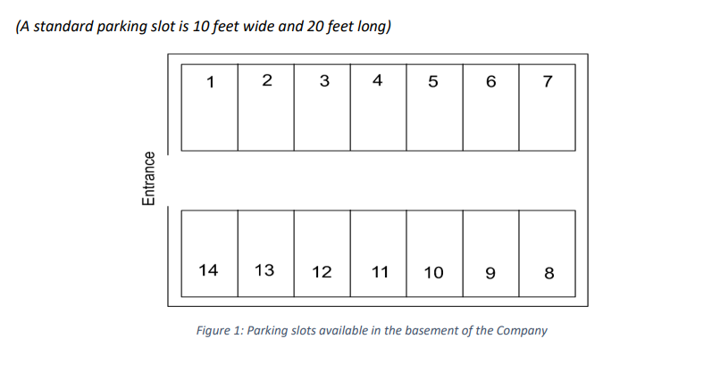
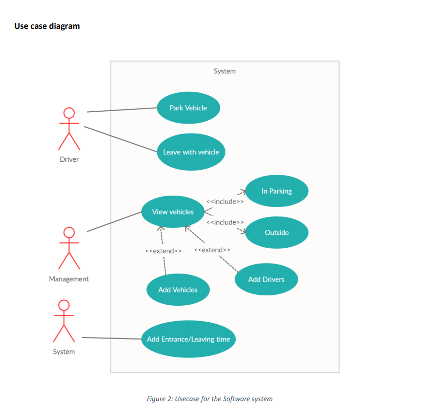
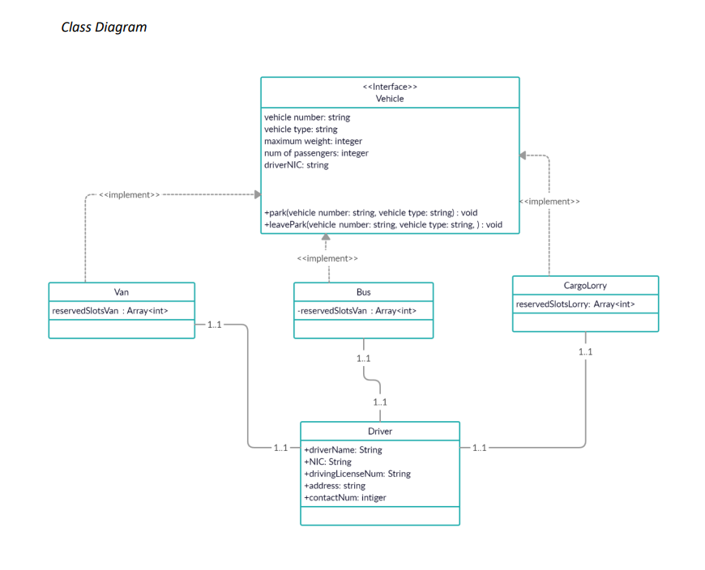

# Vehicle-Parking-System

"Saman Rice" is a company that distributes rice all around Sri Lanka. For distribution, they use a range of
vehicles from vans to lorries with 10 feet long trailers. These vehicles are usually parked in the basement
of the company. There is only one entrance to the basement, where vehicles and the parking space inside
the basement are quite limited.

The security guard in the basement usually manages the vehicle flow and arranges vehicle parking spaces
with great effort due to limited space inside the basement. However, with spontaneous and unorganized
parking that happens occasionally, sometimes drivers of the transport vehicles find themselves in
deadlocks when moving in and out of the basement. In the worst-case scenario, they might not even find
a parking slot to park the Transport Vehicles.

To alleviate the situation, the company decided to divide the basement into sections (Parking-slots),
assign numbers to them, and implement a system for drivers to park their vehicles orderly.

The basement was divided into parking slots as follows,



## Objectives

- Object-oriented programming concepts
- JavaFX application development
- In-memory application development
- How to display time on the system real-time

## Built with

- Java
- JavaFX

## Proposed Parking Process

1. When a driver brings the vehicle to the entrance of the basement, he can choose the vehicle that
   he is driving from the panel available at the side of the entrance of the basement. Then the system
   will assign a parking slot that is available matching the vehicle criteria.
2. Then the driver can park the vehicle at the given slot.
3. When a driver leaves with a vehicle, he should enter his name and select the vehicle that he is
   driving.
4. Parking slots 1,2,3,4,13 and 12 are reserved for vans.
5. Slot number 14 is reserved for the employee transportation bus of the company.
6. The company has 14 vehicles 
7. The company has 16 drivers. 

## System Requirements

1. The driver should be able to select his name and the vehicle number he is driving when bringing
   the vehicles in and out of the basement.
2. The 14th slot should only be available for the employee transportation bus.
3. When parking, slots should be assigned to vehicles in the ascending order.
4. Parking time and the leaving time of the vehicles should be automatically saved, and the
   management should be able to view them from the interface at the entrance of the basement.
5. If a slot number in between two vehicles is freed, the vehicle should be assigned to park in the
   first available slot when the slot numbers are arranged in the ascending order.
6. Management should be able to see the list of vehicles outside the company premises and the
   drivers who are driving the vehicle.
7. When the driver comes to park the vehicle and selects the vehicle number, driver name
   and the vehicle type should automatically be selected.
8. If a vehicle outside the car park is selected, the "On delivery shift" button should be disabled.
9. If a vehicle is inside the car park is selected, the "Park Vehicle" button should be disabled.





```
Management Login

username : admin
password : 1234
```

## LICENSE

See the [LICENSE](LICENSE) for more information.


